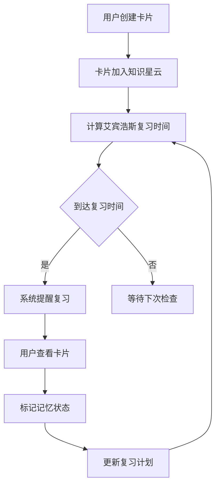

## 1. Product Overview
一款基于艾宾浩斯遗忘曲线的考研记忆卡片软件，通过知识星云可视化展示考研知识点，帮助用户高效学习和巩固数学、408、英语、政治等科目内容。
- 主界面采用3D星云动画，知识点以发光节点形式呈现，点击弹出对应卡片进行学习
- 结合艾宾浩斯遗忘曲线自动安排复习计划，智能提醒用户复习时间

## 2. Core Features

### 2.1 User Roles
| Role | Registration Method | Core Permissions |
|------|---------------------|------------------|
| Normal User | Email registration | Create, edit, review flashcards |

### 2.2 Feature Module
1. **知识星云首页**: 3D旋转星云、知识点节点、搜索功能
2. **卡片详情页**: 正面问题、背面答案、记忆状态切换
3. **复习计划页**: 艾宾浩斯复习列表、复习进度统计
4. **卡片管理页**: 添加/编辑/删除卡片、分类管理

### 2.3 Page Details
| Page Name | Module Name | Feature description |
|-----------|-------------|---------------------|
| 知识星云首页 | 3D星云 | 知识点以发光球体形式在星云中旋转，支持拖拽旋转视角 |
| 知识星云首页 | 节点交互 | 鼠标悬停显示知识点标题，点击弹出卡片详情 |
| 卡片详情页 | 翻转效果 | 点击卡片翻转显示答案，支持记忆状态选择 |
| 复习计划页 | 智能提醒 | 基于艾宾浩斯曲线计算下次复习时间，显示待复习卡片 |
| 复习计划页 | 进度统计 | 学习天数、卡片总数、掌握程度统计图表 |
| 卡片管理页 | CRUD操作 | 添加新卡片、编辑已有卡片、删除不需要的卡片 |
| 卡片管理页 | 分类管理 | 创建分类、为卡片分配分类、筛选查看 |

## 3. Core Process

用户创建卡片 → 卡片加入知识星云 → 根据艾宾浩斯曲线计算复习时间 → 系统提醒复习 → 用户复习并标记状态 → 更新记忆曲线数据

## 4. User Interface Design

### 4.1 Design Style
- **主色调**: 深蓝紫色 (#1a1a2e) 背景，渐变蓝紫 (#4a1942 → #2d1b69) 作为强调色
- **辅助色**: 青色 (#00d4ff) 用于发光效果，粉色 (#ff6b9d) 用于交互反馈
- **按钮风格**: 圆角、渐变填充、悬停发光效果
- **字体**: 使用 'Orbitron' 作为标题字体，'Inter' 作为正文字体
- **布局风格**: 深色主题、星空背景、卡片式设计
- **动画**: 3D星云旋转、卡片翻转动画、粒子效果

### 4.2 Page Design Overview
| Page Name | Module Name | UI Elements |
|-----------|-------------|-------------|
| 知识星云首页 | 背景 | 动态星空粒子效果，深紫渐变背景 |
| 知识星云首页 | 3D星云 | Three.js 渲染的旋转球体，每个节点代表一个知识点 |
| 知识星云首页 | 搜索框 | 顶部搜索栏，支持按标题/内容搜索卡片 |
| 卡片详情页 | 卡片容器 | 居中展示，支持翻转查看答案 |
| 卡片详情页 | 操作按钮 | 忘记/模糊/记得 三个状态按钮，更新复习计划 |
| 复习计划页 | 统计面板 | 环形进度图显示掌握程度，条形图显示每日学习量 |
| 卡片管理页 | 卡片列表 | 网格布局展示所有卡片，支持分页和筛选 |

### 4.3 Responsiveness
- **Desktop**: 完整3D星云效果，多栏布局
- **Tablet**: 简化3D效果，两栏布局
- **Mobile**: 2D节点列表替代3D星云，单栏布局

### 4.4 3D Scene Guidance
- **环境**: 深色太空背景，星星粒子效果
- **光照**: 点光源从中心向外照射，每个节点自带发光材质
- **相机**: 环绕星云的轨道相机，支持鼠标拖拽旋转
- **构图**: 星云位于画面中央，节点均匀分布在球体表面
- **交互**: 鼠标悬停高亮节点，点击弹出详情卡片
- **动画**: 星云缓慢自转，节点有轻微浮动效果
