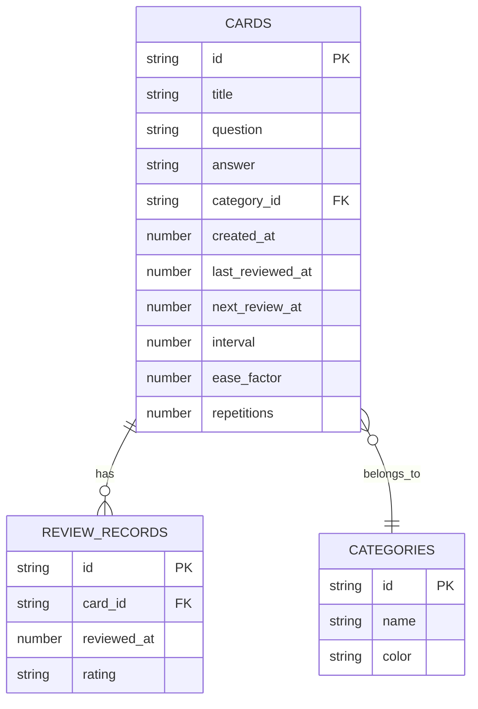

## 1. Architecture Design

```mermaid
flowchart TB
    subgraph Frontend
        A[React Components]
        B[Zustand Store]
        C[Three.js Scene]
    end
    
    subgraph Data Layer
        D[Local Storage]
        E[IndexedDB]
    end
    
    Frontend --> Data Layer
```

## 2. Technology Description
- **Frontend**: React@18 + TypeScript + TailwindCSS@3 + Vite
- **3D Rendering**: Three.js + @react-three/fiber + @react-three/drei
- **State Management**: Zustand
- **Database**: Local Storage + IndexedDB (用于存储卡片数据)
- **Icons**: Lucide React
- **Charts**: Recharts

## 3. Route Definitions
| Route | Purpose |
|-------|---------|
| / | 知识星云首页 |
| /review | 复习计划页 |
| /manage | 卡片管理页 |
| /add | 添加新卡片 |

## 4. API Definitions (Local Storage)

### 4.1 Card Interface
```typescript
interface Card {
  id: string;
  title: string;
  question: string;
  answer: string;
  category: string;
  createdAt: number;
  lastReviewedAt: number | null;
  nextReviewAt: number;
  interval: number;
  easeFactor: number;
  repetitions: number;
}
```

### 4.2 Category Interface
```typescript
interface Category {
  id: string;
  name: string;
  color: string;
}
```

### 4.3 ReviewRecord Interface
```typescript
interface ReviewRecord {
  cardId: string;
  reviewedAt: number;
  rating: 'forgot' | 'hard' | 'good' | 'easy';
}
```

## 5. Server Architecture Diagram
无后端服务器，使用本地存储方案。

## 6. Data Model

### 6.1 Data Model Definition


### 6.2 Data Definition Language
```sql
-- Cards Table (IndexedDB object store)
CREATE TABLE cards (
    id TEXT PRIMARY KEY,
    title TEXT NOT NULL,
    question TEXT NOT NULL,
    answer TEXT NOT NULL,
    category_id TEXT,
    created_at INTEGER NOT NULL,
    last_reviewed_at INTEGER,
    next_review_at INTEGER NOT NULL,
    interval INTEGER NOT NULL DEFAULT 1,
    ease_factor REAL NOT NULL DEFAULT 2.5,
    repetitions INTEGER NOT NULL DEFAULT 0
);

-- Categories Table
CREATE TABLE categories (
    id TEXT PRIMARY KEY,
    name TEXT NOT NULL,
    color TEXT NOT NULL
);

-- Review Records Table
CREATE TABLE review_records (
    id TEXT PRIMARY KEY,
    card_id TEXT NOT NULL,
    reviewed_at INTEGER NOT NULL,
    rating TEXT NOT NULL
);
```

### 6.3 Initial Data
```typescript
// 默认分类（考研科目）
const defaultCategories = [
  { id: 'cat-1', name: '数学', color: '#00d4ff' },
  { id: 'cat-2', name: '408', color: '#ff6b9d' },
  { id: 'cat-3', name: '英语', color: '#ffd93d' },
  { id: 'cat-4', name: '政治', color: '#6bcb77' },
];

// 示例卡片（考研知识点）
const sampleCards = [
  {
    id: 'card-1',
    title: '极限的定义',
    question: 'ε-δ 定义中，对于任意 ε>0，存在 δ>0，使得什么条件成立？',
    answer: '当 0<|x-x₀|<δ 时，|f(x)-A|<ε',
    category_id: 'cat-1',
    created_at: Date.now(),
    last_reviewed_at: null,
    next_review_at: Date.now(),
    interval: 1,
    ease_factor: 2.5,
    repetitions: 0,
  },
  {
    id: 'card-2',
    title: '进程与线程',
    question: '进程和线程的主要区别是什么？',
    answer: '进程是资源分配的基本单位，线程是CPU调度的基本单位；同一进程内的线程共享进程资源',
    category_id: 'cat-2',
    created_at: Date.now(),
    last_reviewed_at: null,
    next_review_at: Date.now(),
    interval: 1,
    ease_factor: 2.5,
    repetitions: 0,
  },
  {
    id: 'card-3',
    title: '虚拟内存',
    question: '虚拟内存的主要作用是什么？',
    answer: '扩展可用的内存空间，将磁盘空间作为内存使用，实现程序的地址空间隔离',
    category_id: 'cat-2',
    created_at: Date.now(),
    last_reviewed_at: null,
    next_review_at: Date.now(),
    interval: 1,
    ease_factor: 2.5,
    repetitions: 0,
  },
];
```
